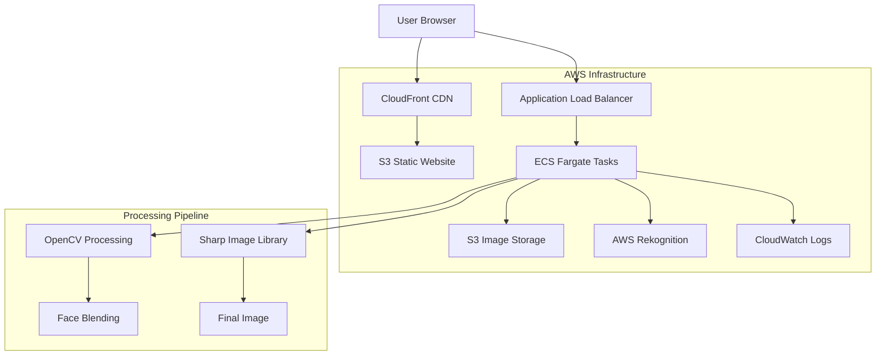
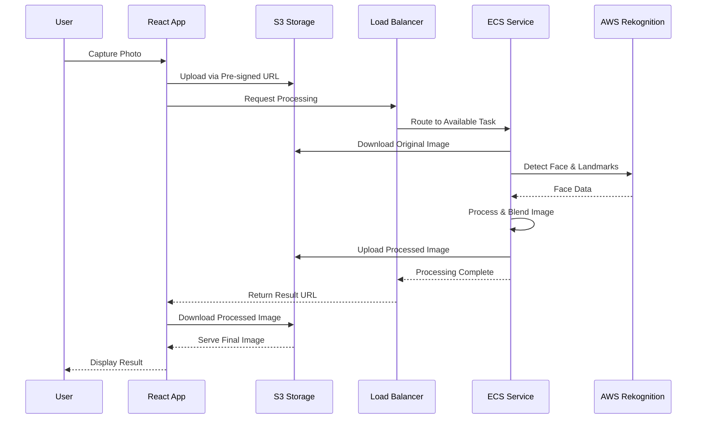

# Design Document

## Overview

The AI Photobooth application is designed as a modern, cloud-native web application that leverages AWS services for scalable image processing. The system uses a React frontend for user interaction, AWS ECS Fargate with GPU support for AI-powered face processing, and a comprehensive AWS infrastructure stack for storage, delivery, and monitoring.

The architecture follows a serverless-first approach where possible, with containerized processing services for GPU-intensive operations. The design prioritizes user experience, security, and scalability while maintaining cost efficiency through auto-scaling and lifecycle policies.

## Architecture

### High-Level Architecture



### Data Flow Architecture



## Components and Interfaces

### Frontend Components (React + TypeScript)

#### Core Components
- **CameraCapture**: Handles WebRTC camera access, live preview, and photo capture
- **ThemeSelector**: Displays theme gallery and manages theme selection
- **ImageProcessor**: Manages the processing workflow and displays progress
- **ImagePreview**: Shows processed results and handles download functionality
- **ErrorBoundary**: Provides graceful error handling and user feedback

#### State Management
- **Context API**: For global application state (current photo, selected theme, processing status)
- **React Query**: For server state management and caching of API responses
- **Local Storage**: For user preferences and temporary data persistence

#### Key Interfaces
```typescript
interface CapturedPhoto {
  id: string;
  blob: Blob;
  dataUrl: string;
  timestamp: Date;
  dimensions: { width: number; height: number; };
}

interface Theme {
  id: string;
  name: string;
  description: string;
  thumbnailUrl: string;
  templateUrl: string;
  variants: ThemeVariant[];
}

interface ProcessingRequest {
  photoId: string;
  themeId: string;
  variantId?: string;
  outputFormat: 'jpeg' | 'png';
}

interface ProcessingResult {
  id: string;
  status: 'processing' | 'completed' | 'failed';
  resultUrl?: string;
  error?: string;
  processingTime?: number;
}
```

### Backend API (Node.js + Express + TypeScript)

#### API Endpoints
- **POST /api/upload/presigned**: Generate pre-signed S3 URLs for image upload
- **POST /api/process**: Initiate image processing with theme selection
- **GET /api/process/:id**: Check processing status and retrieve results
- **GET /api/themes**: Retrieve available themes and variants
- **GET /api/health**: Health check endpoint for load balancer

#### Processing Service Architecture
```typescript
interface FaceProcessingService {
  detectFace(imageBuffer: Buffer): Promise<FaceDetectionResult>;
  extractLandmarks(faceData: FaceDetectionResult): Promise<FacialLandmarks>;
  validateQuality(faceData: FaceDetectionResult): Promise<QualityMetrics>;
  alignFace(face: FacialLandmarks, template: ThemeTemplate): Promise<AlignedFace>;
  blendFace(alignedFace: AlignedFace, background: Buffer): Promise<Buffer>;
}

interface ImageProcessingPipeline {
  process(request: ProcessingRequest): Promise<ProcessingResult>;
  retry(requestId: string): Promise<ProcessingResult>;
  cleanup(requestId: string): Promise<void>;
}
```

### AWS Infrastructure Components

#### ECS Fargate Configuration
- **Task Definition**: GPU-enabled containers with OpenCV, dlib, and Sharp
- **Service**: Auto-scaling configuration (2-10 tasks based on CPU/memory)
- **Load Balancer**: Application Load Balancer with health checks
- **Security Groups**: Restricted access for ECS tasks and ALB

#### S3 Storage Structure
```
photobooth-bucket/
├── uploads/
│   └── {date}/{uuid}.jpg (auto-delete after 24h)
├── processed/
│   └── {date}/{uuid}.jpg (auto-delete after 7 days)
├── themes/
│   ├── templates/
│   └── thumbnails/
└── static/
    └── webapp/ (React build artifacts)
```

#### CloudFront Distribution
- **Origin**: S3 static website hosting
- **Behaviors**: Optimized caching for static assets and API routes
- **Security**: HTTPS redirect, security headers, CORS configuration

## Data Models

### Core Data Models

#### Face Detection Model
```typescript
interface FaceDetectionResult {
  boundingBox: {
    left: number;
    top: number;
    width: number;
    height: number;
  };
  confidence: number;
  landmarks: FacialLandmark[];
  quality: {
    brightness: number;
    sharpness: number;
    pose: {
      roll: number;
      yaw: number;
      pitch: number;
    };
  };
}

interface FacialLandmark {
  type: 'eyeLeft' | 'eyeRight' | 'nose' | 'mouthLeft' | 'mouthRight' | string;
  x: number;
  y: number;
}
```

#### Theme Template Model
```typescript
interface ThemeTemplate {
  id: string;
  name: string;
  backgroundImage: string;
  faceRegion: {
    x: number;
    y: number;
    width: number;
    height: number;
    rotation: number;
  };
  blendingMask?: string;
  colorAdjustments: {
    brightness: number;
    contrast: number;
    saturation: number;
    hue: number;
  };
}
```

#### Processing Job Model
```typescript
interface ProcessingJob {
  id: string;
  userId?: string;
  originalImageUrl: string;
  themeId: string;
  status: 'queued' | 'processing' | 'completed' | 'failed';
  resultImageUrl?: string;
  error?: string;
  createdAt: Date;
  completedAt?: Date;
  processingTimeMs?: number;
  retryCount: number;
}
```

### Database Schema (DynamoDB)

#### ProcessingJobs Table
- **Partition Key**: jobId (string)
- **Attributes**: status, originalImageUrl, resultImageUrl, themeId, createdAt, completedAt, error, retryCount
- **TTL**: Auto-delete after 7 days
- **GSI**: status-createdAt-index for monitoring and cleanup

#### Themes Table
- **Partition Key**: themeId (string)
- **Attributes**: name, description, templateUrl, thumbnailUrl, variants, isActive
- **No TTL**: Persistent theme data

## Error Handling

### Error Classification and Responses

#### Client-Side Errors (4xx)
- **400 Bad Request**: Invalid image format, size exceeds limit, missing required fields
- **413 Payload Too Large**: Image file exceeds 10MB limit
- **429 Too Many Requests**: Rate limit exceeded (10 requests/minute/IP)

#### Server-Side Errors (5xx)
- **500 Internal Server Error**: Unexpected processing failures
- **503 Service Unavailable**: ECS service scaling or AWS service issues
- **504 Gateway Timeout**: Processing exceeds 15-second timeout

#### Processing-Specific Errors
```typescript
enum ProcessingErrorType {
  NO_FACE_DETECTED = 'NO_FACE_DETECTED',
  MULTIPLE_FACES = 'MULTIPLE_FACES',
  POOR_IMAGE_QUALITY = 'POOR_IMAGE_QUALITY',
  FACE_TOO_SMALL = 'FACE_TOO_SMALL',
  EXTREME_POSE = 'EXTREME_POSE',
  PROCESSING_TIMEOUT = 'PROCESSING_TIMEOUT',
  THEME_NOT_FOUND = 'THEME_NOT_FOUND',
  INTERNAL_ERROR = 'INTERNAL_ERROR'
}

interface ProcessingError {
  type: ProcessingErrorType;
  message: string;
  userMessage: string;
  retryable: boolean;
  suggestions?: string[];
}
```

### Retry Logic and Circuit Breaker
- **Exponential Backoff**: 1s, 2s, 4s delays for retryable errors
- **Circuit Breaker**: Open circuit after 5 consecutive failures, half-open after 30s
- **Dead Letter Queue**: Failed jobs moved to DLQ for manual investigation

### User Experience Error Handling
- **Progressive Enhancement**: Graceful degradation when features unavailable
- **Error Recovery**: Clear instructions for user actions (retake photo, try different angle)
- **Fallback Options**: Alternative themes or processing modes when primary fails

## Testing Strategy

### Frontend Testing

#### Unit Tests (Jest + React Testing Library)
- Component rendering and user interactions
- State management and context providers
- Utility functions and image processing helpers
- Camera API mocking and error scenarios

#### Integration Tests
- End-to-end user workflows (capture → select → process → download)
- API integration with mock backend responses
- Error boundary and error recovery flows
- Cross-browser compatibility (Chrome, Firefox, Safari, Edge)

#### Visual Regression Tests (Playwright)
- Theme gallery rendering consistency
- Camera preview and controls layout
- Processing progress indicators
- Responsive design across device sizes

### Backend Testing

#### Unit Tests (Jest + Supertest)
- API endpoint request/response validation
- Image processing pipeline components
- AWS service integration mocking
- Error handling and retry logic

#### Integration Tests
- Complete processing workflow with real AWS services
- S3 upload/download operations
- DynamoDB read/write operations
- ECS task execution and scaling

#### Load Testing (Artillery.js)
- Concurrent user simulation (100+ users)
- Processing queue performance under load
- Auto-scaling behavior validation
- Rate limiting effectiveness

### Infrastructure Testing

#### AWS CDK Testing
- Infrastructure unit tests for CDK constructs
- Security group and IAM policy validation
- Resource tagging and lifecycle policies
- Cost optimization and resource limits

#### End-to-End Testing
- Complete deployment pipeline validation
- Blue-green deployment testing
- Disaster recovery and backup procedures
- Monitoring and alerting verification

### Performance Testing

#### Metrics and Benchmarks
- **Page Load Time**: < 3 seconds (target: 1.5 seconds)
- **Processing Time**: < 15 seconds (target: 8 seconds)
- **API Response Time**: < 200ms (excluding processing)
- **Concurrent Users**: 100+ without degradation

#### Monitoring and Observability
- **CloudWatch Metrics**: Custom metrics for processing time, success rate, error types
- **X-Ray Tracing**: Distributed tracing for request flow analysis
- **Real User Monitoring**: Client-side performance metrics and error tracking
- **Synthetic Monitoring**: Automated testing of critical user journeys