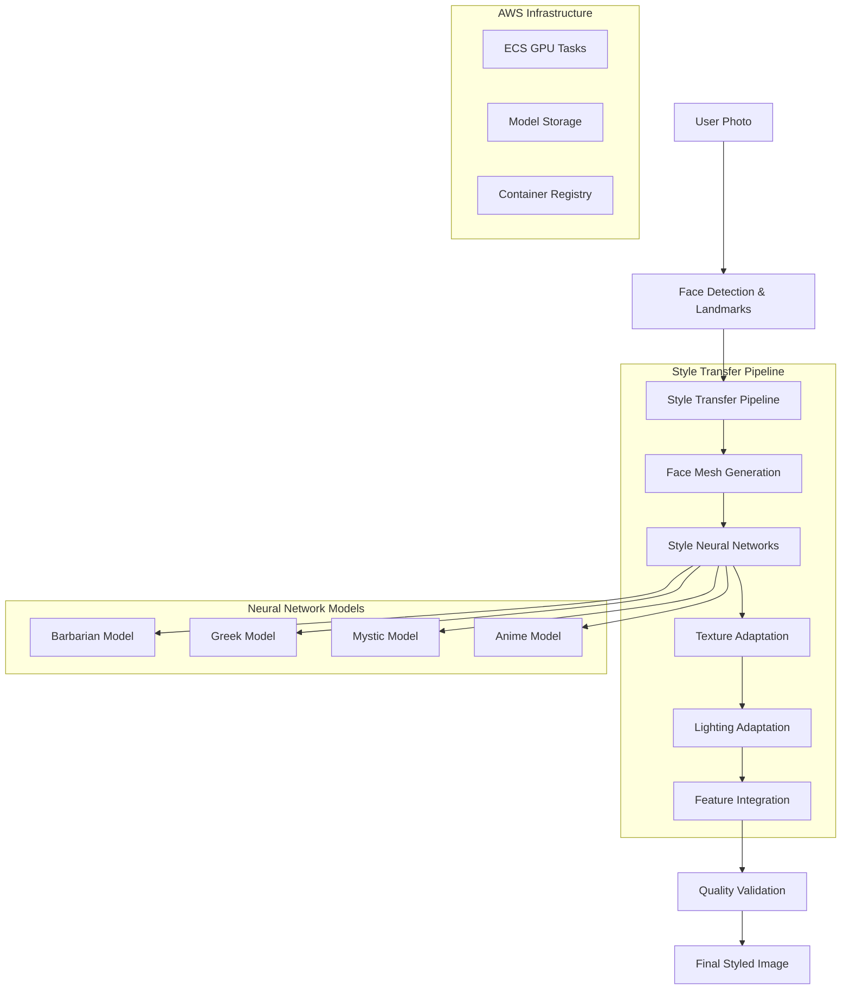
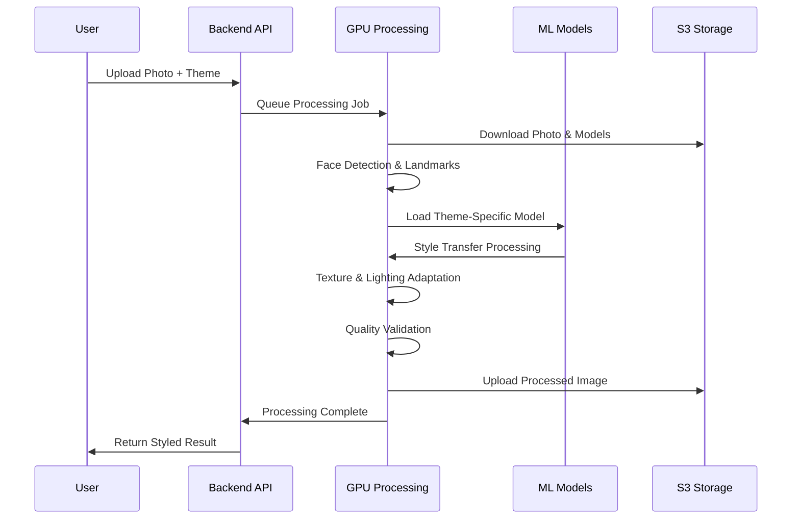

# Design Document

## Overview

The AI Style Transfer system transforms the current basic face placement approach into an advanced neural network-powered style adaptation system. Instead of simply overlaying faces onto templates, this system will use deep learning models to authentically transform facial features, skin texture, hair, eyes, and lighting to match the aesthetic of each theme.

The design leverages pre-trained style transfer models, facial landmark detection, and custom neural networks to create realistic transformations while maintaining the user's core identity. The system will use GPU-accelerated processing on AWS ECS with specialized ML containers.

## Architecture

### High-Level Architecture



### Processing Pipeline Architecture



## Components and Interfaces

### Core Processing Components

#### StyleTransferEngine
```typescript
interface StyleTransferEngine {
  processImage(input: ProcessingInput): Promise<ProcessingResult>;
  validateQuality(result: ProcessedImage): Promise<QualityMetrics>;
  fallbackProcessing(input: ProcessingInput): Promise<ProcessingResult>;
}

interface ProcessingInput {
  originalImage: Buffer;
  theme: ThemeType;
  faceData: FaceDetectionResult;
  processingOptions: ProcessingOptions;
}

interface ProcessingOptions {
  quality: 'fast' | 'balanced' | 'high';
  styleIntensity: number; // 0.1 to 1.0
  preserveIdentity: number; // 0.7 to 1.0
  enableAdvancedFeatures: boolean;
}
```

#### Neural Network Models
```typescript
interface StyleModel {
  modelType: ThemeType;
  modelPath: string;
  inputSize: { width: number; height: number; };
  outputSize: { width: number; height: number; };
  processingTime: number; // estimated seconds
  gpuMemoryRequired: number; // MB
}

interface ThemeStyleConfig {
  barbarian: {
    skinTexture: 'weathered' | 'scarred' | 'rugged';
    hairStyle: 'wild' | 'braided' | 'warrior';
    eyeIntensity: number;
    facialHairEnhancement: boolean;
  };
  greek: {
    skinTexture: 'marble' | 'smooth' | 'classical';
    hairStyle: 'curled' | 'braided' | 'classical';
    proportionAdjustment: 'golden_ratio';
    lightingStyle: 'soft_classical';
  };
  mystic: {
    skinTexture: 'ethereal' | 'glowing' | 'otherworldly';
    eyeEffects: 'magical_glow' | 'color_shift';
    hairEffects: 'flowing' | 'color_highlights';
    atmosphericEffects: boolean;
  };
  anime: {
    eyeEnlargement: number; // 1.2 to 2.0
    skinSmoothing: number; // 0.8 to 1.0
    colorSaturation: number; // 1.2 to 1.8
    cellShading: boolean;
  };
}
```

### Advanced Processing Services

#### FaceMeshGenerator
```typescript
interface FaceMeshGenerator {
  generateMesh(landmarks: FacialLandmark[]): Promise<FaceMesh>;
  optimizeMesh(mesh: FaceMesh, theme: ThemeType): Promise<OptimizedMesh>;
  validateMeshQuality(mesh: FaceMesh): Promise<MeshQualityMetrics>;
}

interface FaceMesh {
  vertices: Vector3[];
  triangles: Triangle[];
  uvMapping: UVCoordinate[];
  normalMap: NormalVector[];
}
```

#### TextureAdaptationService
```typescript
interface TextureAdaptationService {
  adaptSkinTexture(face: FaceMesh, theme: ThemeType): Promise<TexturedFace>;
  enhanceHairTexture(hairRegion: ImageRegion, style: HairStyle): Promise<StyledHair>;
  applyMakeupEffects(face: FaceMesh, theme: ThemeType): Promise<MakeupResult>;
}

interface TexturedFace {
  baseTexture: Texture2D;
  normalMap: Texture2D;
  specularMap: Texture2D;
  roughnessMap: Texture2D;
}
```

#### LightingAdaptationService
```typescript
interface LightingAdaptationService {
  analyzeLighting(background: Buffer): Promise<LightingAnalysis>;
  adaptFaceLighting(face: FaceMesh, lighting: LightingAnalysis): Promise<LitFace>;
  addAtmosphericEffects(image: Buffer, theme: ThemeType): Promise<AtmosphericResult>;
}

interface LightingAnalysis {
  primaryLightDirection: Vector3;
  lightColor: RGB;
  ambientIntensity: number;
  shadowHardness: number;
  atmosphericConditions: AtmosphericData;
}
```

### Quality Control System

#### QualityValidator
```typescript
interface QualityValidator {
  validateRealism(result: ProcessedImage): Promise<RealismScore>;
  detectArtifacts(result: ProcessedImage): Promise<ArtifactReport>;
  validateIdentityPreservation(original: Buffer, result: Buffer): Promise<IdentityScore>;
}

interface RealismScore {
  overall: number; // 0.0 to 1.0
  facialProportions: number;
  skinTexture: number;
  lightingConsistency: number;
  edgeBlending: number;
  colorHarmony: number;
}

interface ArtifactReport {
  hasArtifacts: boolean;
  artifactTypes: ArtifactType[];
  severity: 'low' | 'medium' | 'high';
  suggestedFixes: string[];
}
```

## Data Models

### Enhanced Processing Models

#### StyleTransferRequest
```typescript
interface StyleTransferRequest {
  id: string;
  originalImageUrl: string;
  theme: ThemeType;
  styleIntensity: number;
  processingOptions: ProcessingOptions;
  userId?: string;
  createdAt: Date;
  priority: 'low' | 'normal' | 'high';
}

interface StyleTransferResult {
  id: string;
  status: 'queued' | 'processing' | 'completed' | 'failed';
  resultImageUrl?: string;
  processingTimeMs?: number;
  qualityMetrics?: QualityMetrics;
  error?: ProcessingError;
  retryCount: number;
  completedAt?: Date;
}
```

#### Neural Network Configuration
```typescript
interface ModelConfiguration {
  modelName: string;
  version: string;
  framework: 'pytorch' | 'tensorflow' | 'onnx';
  inputFormat: ImageFormat;
  outputFormat: ImageFormat;
  preprocessingSteps: PreprocessingStep[];
  postprocessingSteps: PostprocessingStep[];
  gpuMemoryRequirement: number;
  estimatedProcessingTime: number;
}

interface PreprocessingStep {
  type: 'resize' | 'normalize' | 'crop' | 'align';
  parameters: Record<string, any>;
  order: number;
}
```

### Theme-Specific Data Models

#### ThemeStyleDefinition
```typescript
interface ThemeStyleDefinition {
  themeId: string;
  styleName: string;
  modelPath: string;
  styleParameters: ThemeParameters;
  qualityThresholds: QualityThresholds;
  fallbackOptions: FallbackConfiguration;
}

interface ThemeParameters {
  skinAdaptation: SkinAdaptationConfig;
  hairStyling: HairStylingConfig;
  eyeEnhancement: EyeEnhancementConfig;
  facialAdjustments: FacialAdjustmentConfig;
  lightingEffects: LightingEffectsConfig;
}
```

## Error Handling

### Advanced Error Classification

#### Style Transfer Specific Errors
```typescript
enum StyleTransferErrorType {
  MODEL_LOADING_FAILED = 'MODEL_LOADING_FAILED',
  INSUFFICIENT_GPU_MEMORY = 'INSUFFICIENT_GPU_MEMORY',
  FACE_MESH_GENERATION_FAILED = 'FACE_MESH_GENERATION_FAILED',
  STYLE_TRANSFER_TIMEOUT = 'STYLE_TRANSFER_TIMEOUT',
  QUALITY_VALIDATION_FAILED = 'QUALITY_VALIDATION_FAILED',
  TEXTURE_ADAPTATION_FAILED = 'TEXTURE_ADAPTATION_FAILED',
  LIGHTING_ANALYSIS_FAILED = 'LIGHTING_ANALYSIS_FAILED',
  IDENTITY_PRESERVATION_FAILED = 'IDENTITY_PRESERVATION_FAILED',
  UNCANNY_VALLEY_DETECTED = 'UNCANNY_VALLEY_DETECTED'
}

interface StyleTransferError {
  type: StyleTransferErrorType;
  message: string;
  userMessage: string;
  retryable: boolean;
  fallbackAvailable: boolean;
  suggestedActions: string[];
  technicalDetails?: Record<string, any>;
}
```

### Fallback Processing Strategy
```typescript
interface FallbackStrategy {
  primaryProcessing: ProcessingMethod;
  fallbackLevels: FallbackLevel[];
  qualityThresholds: QualityThreshold[];
  timeoutLimits: TimeoutConfiguration;
}

interface FallbackLevel {
  level: number;
  method: 'reduced_quality' | 'simplified_model' | 'basic_overlay';
  maxProcessingTime: number;
  expectedQuality: number;
  description: string;
}
```

### Quality Control and Recovery
```typescript
interface QualityControlSystem {
  validateResult(result: ProcessedImage): Promise<ValidationResult>;
  suggestImprovements(result: ProcessedImage): Promise<ImprovementSuggestions>;
  retryWithAdjustments(request: StyleTransferRequest, adjustments: ProcessingAdjustments): Promise<StyleTransferResult>;
}

interface ValidationResult {
  passed: boolean;
  score: number;
  issues: QualityIssue[];
  recommendations: string[];
}
```

## Testing Strategy

### Neural Network Model Testing

#### Model Performance Testing
- **Accuracy Testing**: Validate style transfer quality across different face types
- **Speed Benchmarking**: Measure processing time for each model and configuration
- **Memory Usage Testing**: Monitor GPU memory consumption and optimization
- **Batch Processing Testing**: Test concurrent processing capabilities

#### Quality Assurance Testing
- **Visual Regression Testing**: Compare outputs against reference images
- **Identity Preservation Testing**: Ensure facial identity is maintained
- **Style Consistency Testing**: Validate consistent styling across similar inputs
- **Edge Case Testing**: Test with unusual faces, lighting, and angles

### Integration Testing

#### End-to-End Workflow Testing
- **Complete Pipeline Testing**: Test full workflow from upload to styled result
- **Error Recovery Testing**: Validate fallback mechanisms and error handling
- **Performance Testing**: Load testing with concurrent style transfer requests
- **Quality Validation Testing**: Test quality control and validation systems

#### AWS Infrastructure Testing
- **GPU Resource Testing**: Validate ECS GPU task scaling and resource allocation
- **Model Loading Testing**: Test neural network model loading and caching
- **Storage Performance Testing**: Validate S3 performance for large model files
- **Container Orchestration Testing**: Test ECS task management and scaling

### User Experience Testing

#### Subjective Quality Testing
- **A/B Testing**: Compare new style transfer against current basic overlay
- **User Satisfaction Testing**: Gather feedback on style transfer quality
- **Theme Preference Testing**: Validate appeal of different theme styles
- **Mobile Performance Testing**: Test on various mobile devices and browsers

## Implementation Considerations

### Neural Network Model Selection

#### Pre-trained Models
- **StyleGAN2**: For high-quality face generation and style transfer
- **FaceSwapper**: For identity-preserving face adaptation
- **Neural Style Transfer**: For artistic style application
- **Custom Fine-tuned Models**: Theme-specific models trained on curated datasets

#### Model Optimization
- **ONNX Conversion**: Convert models to ONNX for cross-platform compatibility
- **Quantization**: Reduce model size while maintaining quality
- **TensorRT Optimization**: Optimize models for NVIDIA GPU inference
- **Model Caching**: Implement intelligent model loading and caching strategies

### GPU Infrastructure Requirements

#### Hardware Specifications
- **GPU Type**: NVIDIA T4 or V100 instances for optimal performance
- **Memory Requirements**: Minimum 16GB GPU memory for high-quality processing
- **CPU Requirements**: Multi-core CPUs for preprocessing and postprocessing
- **Storage**: High-speed SSD storage for model loading and temporary files

#### Scaling Strategy
- **Auto-scaling**: Scale GPU instances based on queue depth and processing time
- **Load Balancing**: Distribute processing across multiple GPU instances
- **Resource Optimization**: Optimize GPU utilization and minimize idle time
- **Cost Management**: Balance quality, speed, and cost considerations

### Performance Optimization

#### Processing Pipeline Optimization
- **Parallel Processing**: Process different aspects (skin, hair, eyes) in parallel
- **Batch Processing**: Group similar requests for efficient GPU utilization
- **Caching Strategy**: Cache intermediate results and model outputs
- **Progressive Enhancement**: Offer multiple quality levels with different processing times

#### Memory Management
- **Memory Pooling**: Efficient GPU memory allocation and deallocation
- **Model Sharing**: Share loaded models across multiple processing requests
- **Garbage Collection**: Proper cleanup of GPU resources and temporary files
- **Memory Monitoring**: Track and optimize memory usage patterns